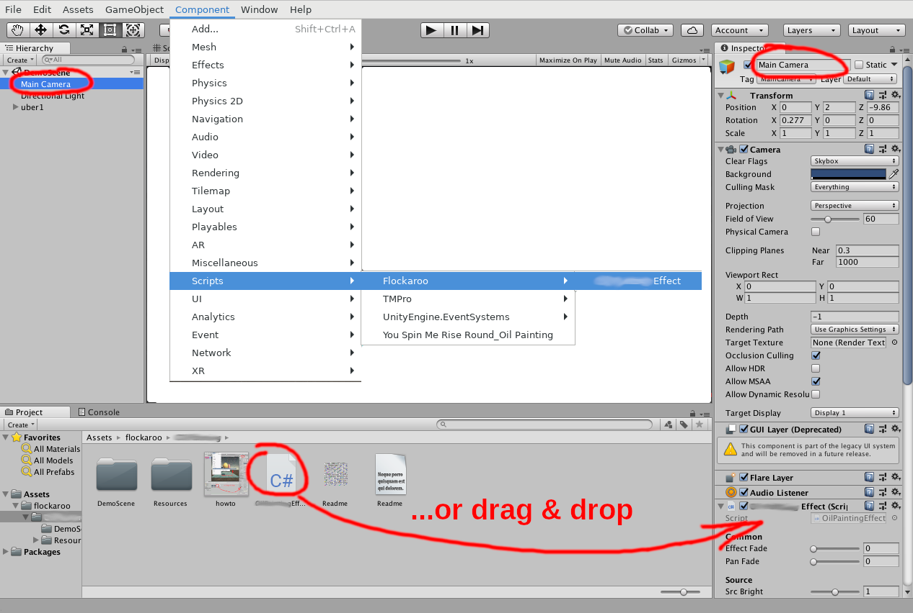

# Sketchy - Unity3D Image Effect
#### (c) 2020 by [flockaroo](http://www.flockaroo.at) (Florian Berger) - email: <flockaroo@gmail.com>

******

### How to use

Select your camera node and then simply add "SketchyEffect" script to camera components (can be found in Assets/flockaroo/Sketchy/).
You can drag/drop it to there or choose it from the menu (Component/Scripts/Flockaroo/Sketchy).

{ width="100%" }

__Warning!!__ The subfolder "flockaroo_Sketchy" in "Resources" is needed by the effect script for unique identification of files and should not be removed or renamed.

### Parameters

The shader provides the following parameters:

#### Input/Output
 | Parameter       | function
 |-----------------|--------------
 | Input Texture   | take this texture as input instead of the camera
 | Render To Texture | render to texture instead of screen
 | Output Texture  | texture being rendered to if above is checked
 | Output Mipmap   | generate mipmap for output texture

#### Effect
 | Parameter       | function
 |-----------------|--------------
 | Master Fade     | 1 = effect image ... 0 = original content
 | Colors          | fade in colors
 | Colors Blur     | blur colors
 | Noise           | add noise to image
 | Outlines        | strength of outlines
 | OutlinesBlur    | blur out lines
 | StrokeSpread    | positional accuracy of outlines
 | StrokeThresh    | drawing strokes depending on local gradient strength
 | VignWidth       | vignetting width
 | Vignetting      | vignetting strength
 | NumTriangles    | number of triangles used for all strokes
<!--params-->

<!--##### Some Hints:
...-->

<!--

-->

#### Other
 | Parameter       | function
 |-----------------|--------------
 | Flip Y          | image Y flip
 | Geom Flip Y     | Y-flip of effect-internal geometry (use this if "Effect Fade" and "Pan Fade" wont work properly)
 | HDRP Gamma      | check this if you are using linear color space (only active in hdrp mode)
 
##### concerning "Flip Y" and "Geom Flip Y":
The screen coordinates of unity are a bit mysterious. even more when working on different platforms. The Y-coordinate seems to be flipped between versions even on the same system, and also flipped depending on the system.

So for "Flip Y" and "Geom Flip Y" follow these rules:

If you have the source ("Effect Fade" to 1) flipped and the effect correct, just check "Geom Flip Y".

If you have the source correct and the effect flipped, check both "Geom Flip Y" and "Flip Y". 

If both are equally flipped just check "Flip Y". 

### HDRP (disabled by default)
The hdrp file is disabled by default !!! here's how to use it:  
Unity wont compile this effect properly if no hdrp support is present
on your version, so in the hdrp ".cs" file in the very first line the "//#USE_HDRP" must be uncommmented to make use the hdrp effect. 
You also have to add it to the list of effects known to your project: 
"Edit/Project Settings... -> HDRP Default Settings -> After Post Process" 
..and then add it as an effect volume by clicking "Add Override" and the
selecting  "Post-processing/Custom/Flockaroo/..."  from the menu.
